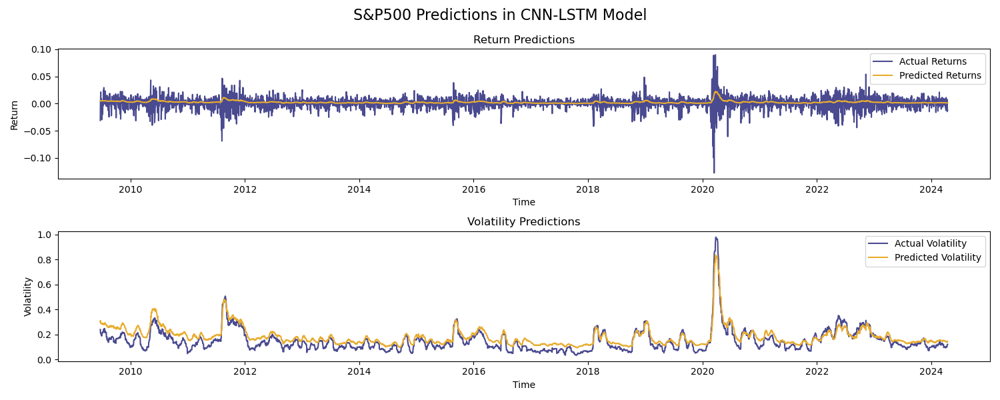
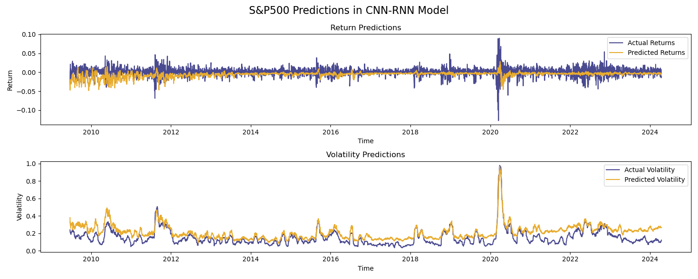
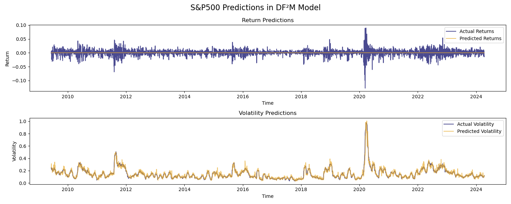
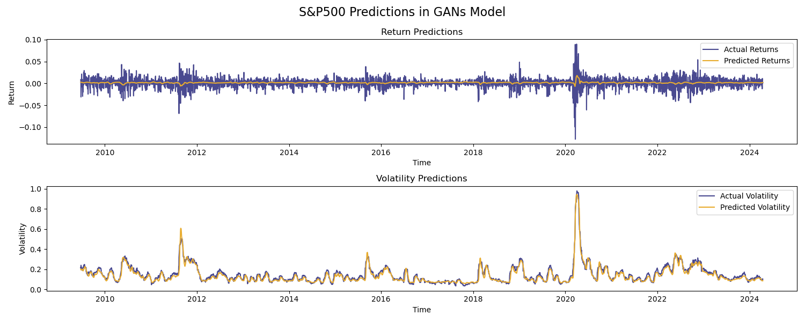
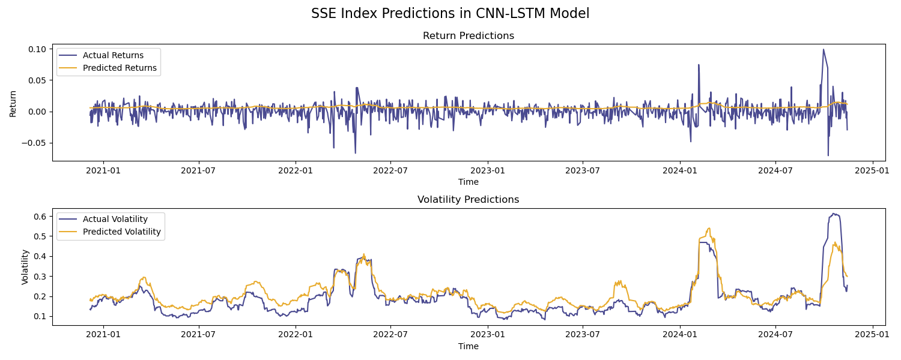
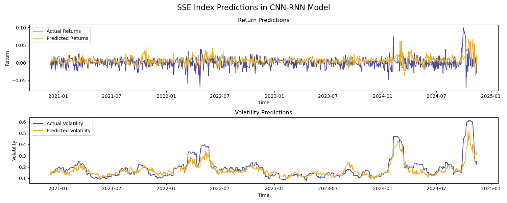
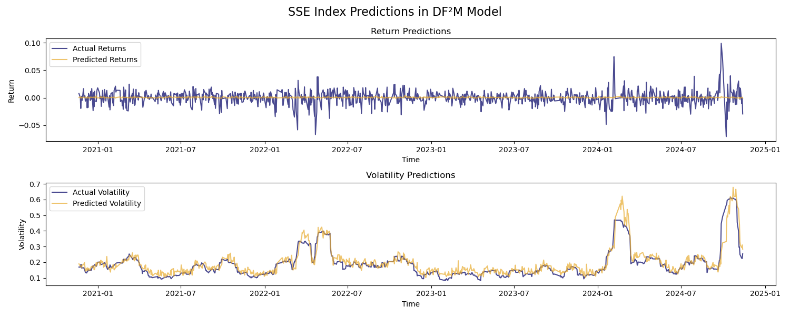
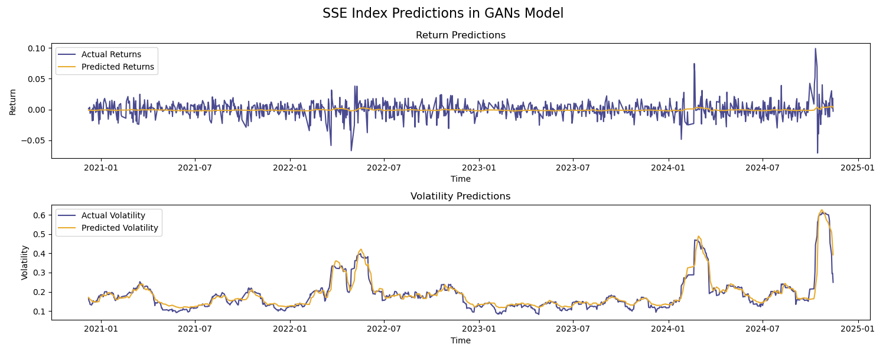
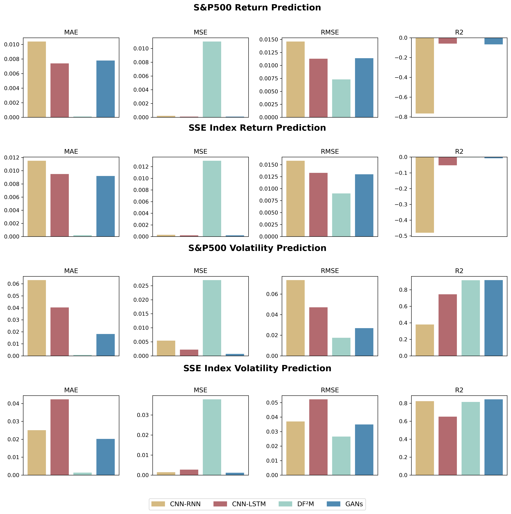

# Deep Learning-Based Financial Time Series Forecasting and Analysis

SYSU Bachelor's Thesis Project

This repository contains a comparative study of deep learning methods for **financial time series forecasting**, with a focus on predicting:

- **Return**
- **Volatility**

using major market indices (S&P 500, CSI 500 / SSE, NASDAQ-100).

---

## Project Structure

```text
.
├── CNNLSTM/    # CNN-LSTM hybrid + CNN-only + LSTM-only + comparison plot script
├── CNNRNN/     # CNN-RNN hybrid + CNN-only + RNN-only + comparison plot script
├── DF2M/       # Factor model / deep factor / DF²M variants + ablation scripts
├── FinGAN/     # FinGAN model + optimized variant + ablation script
├── results/    # Aggregated result figures across models
└── README.md
```

Each model folder generally includes:

- `data/`: CSV datasets (`SP500.csv`, `CSI500.csv`, `NASDAQ_100.csv`)
- one or more training/evaluation scripts (`main*.py`)
- `results/`: generated plots

---

## Models Included

### 1) CNNLSTM (`CNNLSTM/`)
- Hybrid CNN + (Bi)LSTM model: `main.py`
- CNN-only baseline: `main-CNN.py`
- LSTM-only baseline: `main-LSTM.py`
- Metric comparison chart: `print-lstm.py`

### 2) CNNRNN (`CNNRNN/`)
- Hybrid CNN + RNN model: `main.py`
- CNN-only baseline: `main-CNN.py`
- RNN-only baseline: `main-RNN.py`
- Metric comparison chart: `print-rnn.py`

### 3) DF2M (`DF2M/`)
- Factor model with PCA + LSTM: `main.py`
- Deep factor model: `main2.py`
- DF²M (deep functional factor model): `main3.py`
- Ablation variants: `main-no-basis.py`
- DF²M + Sharpe ratio extension: `Sharp-main3.py`
- Metric comparison chart: `print-df2m.py`

### 4) FinGAN (`FinGAN/`)
- Base FinGAN training/evaluation: `main.py`
- Optimized FinGAN variant: `main-opt.py`
- FinGAN ablation study: `main-single.py`

---

## Data Format

The CSV files use columns like:

- `date`
- `open`, `high`, `low`, `close`
- `volume`
- `change_percent`
- `avg_vol_20d`

Most scripts derive targets internally:

- log return from `close`
- rolling volatility from return

---

## Environment Setup

Use Python 3.9+ recommended.

Install core dependencies:

```bash
pip install numpy pandas matplotlib scikit-learn tensorflow keras torch
```

> Note: Different modules use different frameworks:
> - `CNNLSTM`, `CNNRNN`, `FinGAN`: TensorFlow/Keras
> - `DF2M`: PyTorch

---

## How to Run

Run from the repository root:

### CNNLSTM
```bash
python CNNLSTM/main.py
python CNNLSTM/main-CNN.py
python CNNLSTM/main-LSTM.py
python CNNLSTM/print-lstm.py
```

### CNNRNN
```bash
python CNNRNN/main.py
python CNNRNN/main-CNN.py
python CNNRNN/main-RNN.py
python CNNRNN/print-rnn.py
```

### DF2M
```bash
python DF2M/main.py
python DF2M/main2.py
python DF2M/main3.py
python DF2M/main-no-basis.py
python DF2M/Sharp-main3.py
python DF2M/print-df2m.py
```

### FinGAN
```bash
python FinGAN/main.py
python FinGAN/main-opt.py
python FinGAN/main-single.py
```

Generated figures are saved under each module's `results/` folder and in the root-level `results/` aggregation folder.

## Results Gallery

Representative prediction results:

### S&P 500






### SSE / CSI 500







---

## Evaluation Metrics

Across scripts, common metrics include:

- MAE
- MSE
- RMSE
- R²
- Information Ratio (in selected scripts)

---

## Notes

- This is a thesis research codebase with multiple experimental variants.
- Hyperparameters and dataset choice are configured inside each script.
- Some scripts are designed as ablation studies and may take longer to train.
